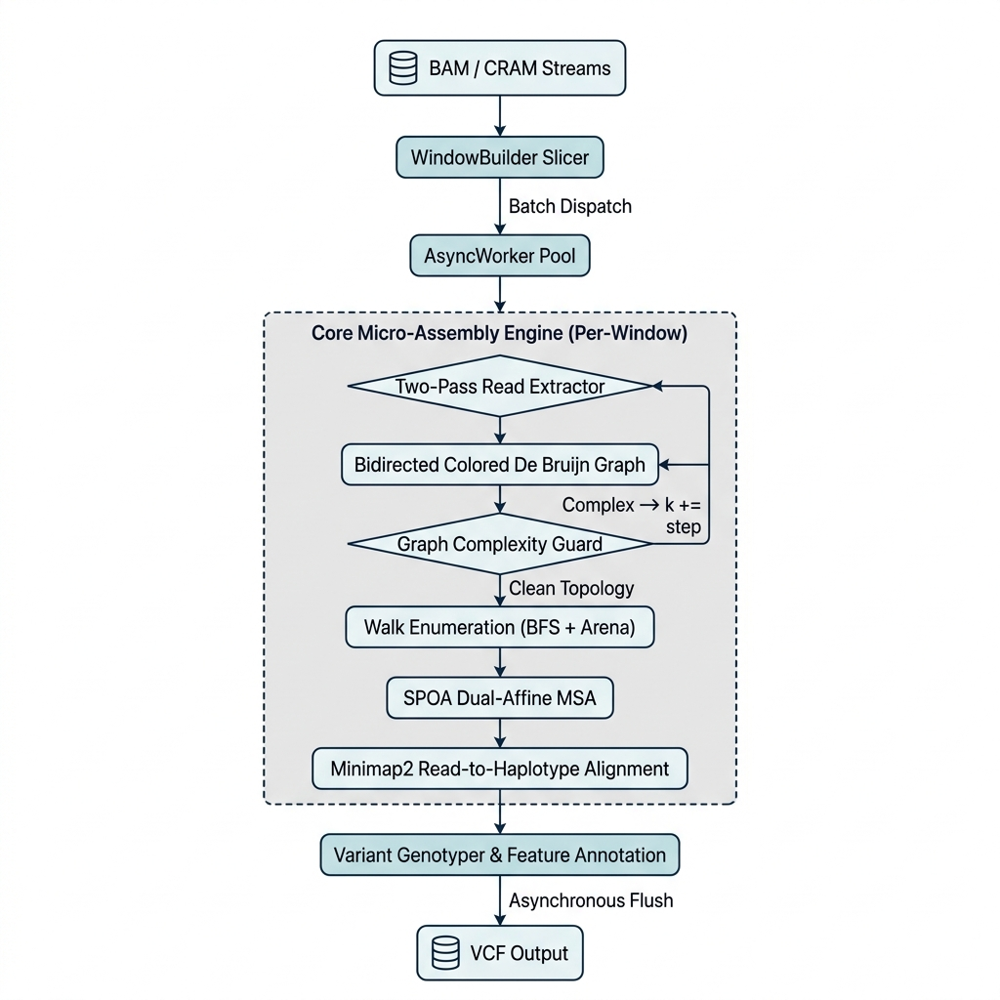

# Lancet2 Pipeline Architecture

Lancet2 is a *de novo* micro-assembly variant caller. It slices the genome into ~1 kbp windows, locally re-assembles all reads in each window into a colored De Bruijn graph, and extracts variant haplotypes directly from the graph topology — bypassing the reference-bias limitations of pileup-based callers.

The core engine (`lancet2 pipeline`) dispatches windows to a lock-free thread pool via `BlockingConcurrentQueue`, processing all windows in parallel up to the user-specified thread limit.

## The High-Level Engine Workflow



## 1. Sequence Ingestion & Downsampling

Lancet2 streams BAM/CRAM regions via `htslib` — including remote `s3://`, `gs://`, `http(s)://`, and `ftp(s)://` URIs — so local copies are never required. **`O(R)`** where R = number of overlapping reads in the window.

Read collection uses a two-pass strategy to minimize memory:

1. **Profile pass** — iterates the region collecting only qname hashes and base counts without deep-copying sequence data. Computes a coverage-based downsampling threshold from `--max-sample-cov`.
2. **Extract pass** — re-iterates, constructing full `Read` objects only for the downsampled subset. Mate-pair links are preserved: if one mate is kept, its partner is always kept.

If the BAM lacks `MD` tags, `--no-active-region` is automatically enabled, disabling the fast-skip heuristic that otherwise filters out windows with no evidence of variation.

* **User tuning:** `--max-sample-cov` (default: 1000×) controls the maximum per-sample coverage retained per window.
* **Read more:** [Native Cloud Streaming](cloud_streaming.md)

## 2. Colored Bidirected De Bruijn Graph

Within each window, reads are shredded into k-mers to build a **colored bidirected De Bruijn graph**. Each node stores a canonical k-mer with two traversal signs (`+`/`-`) following the [BCALM2 bidirected model](https://github.com/GATB/bcalm/blob/v2.2.3/bidirected-graphs-in-bcalm2/bidirected-graphs-in-bcalm2.md). Colors tag each k-mer's origin as Normal, Tumor, or Reference.

Graph construction iterates from the minimum k-mer size (`-k`, default 13) to the maximum (`-K`, default 127) in steps of `-s` (default 6), retrying at larger k when the complexity guard (§3) identifies a tangled repeat structure or a cycle is detected. **`O(R × L / k)`** per k-value, where R = number of reads in the window and L = mean read length.

### K-mer Retry Cascade

If a cycle is detected after pruning, or the complexity guard triggers, the entire graph is **cleared and rebuilt from scratch** at the next k-mer tier. Larger k values collapse short repeat motifs that cause ambiguous graph topology at smaller k. The step size (`-s`) is configurable within the set {2, 4, 6, 8, 10} — smaller steps increase the chance of finding a clean k but cost more rebuild iterations.

Example cascade at defaults: k=13 → 19 → 25 → 31 → ... → 127. If no k produces a cycle-free, low-complexity graph, the window yields no assembled haplotypes.

### Graph Pruning Pipeline

After successful graph construction at a given k, each connected component goes through a fixed 7-stage pruning sequence before walk enumeration:

| Stage | Operation | Purpose |
|:------|:----------|:--------|
| 0 | Low-coverage removal | Remove nodes below `--min-node-cov` |
| 1 | Reference anchor finding | Identify source/sink nodes on the reference path |
| 2 | First compression | Merge linear unitig chains (degree-2 nodes) into single compound nodes |
| 3 | Second low-coverage removal | Re-prune after compression exposes new low-coverage nodes |
| 4 | Second compression | Re-merge after the second pruning pass |
| 5 | Short tip removal | Remove dead-end paths shorter than k |
| 6 | Short link removal | Remove edges between low-support paths |

After pruning, an `O(V+E)` three-color DFS detects cycles on the frozen graph. If a cycle persists, the k-mer retry cascade re-builds at the next tier.

* **User tuning:** `-k` / `-K` for k-mer range; `-s` for step size; `--min-node-cov` to prune noise (higher = faster runtime but lower subclonal sensitivity).

## 3. Complexity Guard

Before walk enumeration, an **`O(V+E)`** topology scan (V = nodes, E = edges in the component) computes two metrics:

- **Cyclomatic Complexity** (CC = E − V + 1): the number of independent cycles.
- **Branch Points** (BP): nodes with ≥2 edges in any sign direction.

If **CC ≥ 50 AND BP ≥ 50**, the component is classified as a tangled repeat region (typically STRs, VNTRs, or segmental duplications), and the engine skips to the next k-mer tier — a larger k collapses short repeats and simplifies the graph.

Thresholds were derived from whole-chromosome profiling (chr4, 233K windows): CC≥50 ∧ BP≥50 captures 146 slow windows averaging 5.8s vs. 414ms for normal windows — a ~14× slowdown that the guard eliminates.

Additional metrics (UnitigRatio, CoverageCv, MaxSingleDirDegree, TipToPathCovRatio) are computed simultaneously and compressed into the **Graph Entanglement Index (GEI)**, a single continuous scalar emitted as an ML feature in the VCF.

* **Read more:** [Graph Complexity](graph_complexity.md)

## 4. Walk Enumeration

After graph pruning, the frozen topology is flattened into a cache-friendly **TraversalIndex** — a [Compressed Sparse Row (CSR)](https://en.wikipedia.org/wiki/Sparse_matrix#Compressed_sparse_row_(CSR,_CRS_or_Yale_format))-like adjacency structure where state lookup and neighbor iteration are `O(1)` array operations instead of hash lookups.

A BFS walk enumerator repeatedly finds source→sink paths, each containing at least one previously un-traversed edge. Walks are built in a compact arena (16 bytes per node: edge ordinal + parent index + accumulated score), avoiding the exponential walk-vector copying of the original Lancet. Outgoing edges are sorted by descending read support so the most prevalent haplotype is discovered first.

**Complexity:** `O(B^L)` worst case per call, where B = max branching factor (outgoing edges per node) and L = path length (number of edges in the walk). Hard-bounded at 1M BFS visits by `DEFAULT_GRAPH_TRAVERSAL_LIMIT`.

The enumerator terminates when no walk with a new edge exists, yielding all distinct haplotype paths through the component.

## 5. MSA & Read-to-Haplotype Alignment

Assembled haplotype paths are aligned into a Multiple Sequence Alignment using **SPOA** (SIMD Partial Order Alignment) with convex dual-affine scoring. The two gap models intersect at ~20bp: Model 1 (`O=-6, E=-2`) penalizes short sequencer-noise gaps; Model 2 (`O=-26, E=-1`) allows cheap extension for large biological indels. Match is anchored at 0 (vs. typical +2) to prevent overflow in SPOA's 8-bit AVX2 SIMD lanes across ~1 kbp windows. **`O(N × L²)`** where N = number of haplotypes and L = contig length.

Variants are extracted from the POA graph's column-aligned topology. Each raw variant records its coordinates on every haplotype for downstream genotyping.

Reads are then re-aligned to each assembled haplotype using **minimap2** with custom parameters tuned for local-assembly genotyping:

| Parameter | Override | Rationale |
|-----------|----------|-----------|
| Z-Drop | 100,000 (effectively disabled) | Prevents alignment truncation across large somatic deletions |
| Bandwidth (`bw`) | 10,000 | Envelopes insertions up to ~2 kbp within the local window |
| Seed k/w | 11 / 5 | Maps highly mutated fragments that lack 15bp exact matches |

Since alignment is restricted to the local contig window (~1 kbp), the inflated parameters have minimal runtime impact compared to whole-genome alignment. **`O(H × R × L)`** per window, where H = number of haplotypes, R = number of reads, and L = contig length.

* **Read more:** [Alignment-Derived Annotations](alignment_annotations.md)

## 6. Genotyping & Feature Annotation

Each read is assigned to its best-matching allele using a combined scoring function that integrates the global alignment score, PBQ-weighted local DP score within the variant region, and soft-clip penalties (see [Alignment Annotations](alignment_annotations.md) for details).

**Genotype calling** follows the standard per-read likelihood model: `P(read | GT) = 0.5 × P(read|a₁) + 0.5 × P(read|a₂)` across all diploid genotypes, producing Phred-scaled likelihoods (PL) and genotype quality (GQ, capped at 99).

All FORMAT annotations are designed to be **coverage-invariant** — they measure effect sizes rather than statistical significance, so a model trained at 30× generalizes to 2000×:

| Feature | Type | Coverage Behavior |
|---------|------|-------------------|
| Cohen's D (RPCD, BQCD, MQCD) | Effect size | Bounded; identical value at any depth |
| Polar Coords (PRAD, PANG) | Geometric transform | PANG is a pure ratio; PRAD log-compressed to [0, ~3.5] |
| Strand Bias (SB) | Log odds ratio | Measures imbalance magnitude, not significance |
| NPBQ | Normalized PBQ | Raw PBQ / allele depth → converges to ~Q30 at any depth |

Optionally, sequence complexity (LongdustQ, Shannon Entropy) and graph topology (Graph Entanglement Index) annotations are added as INFO-level ML features when `--enable-sequence-complexity-features` / `--enable-graph-complexity-features` are enabled.

* **Read more:** [Variant Discovery & Genotyping](variant_discovery_genotyping.md), [Sequence Complexity](sequence_complexity.md), [Polar Coordinate Features](polar_features.md), [VCF Output Reference](vcf_output.md), [Scoring Somatic Variants](scoring_somatic_variants.md)

## 7. Performance & Parallelism

The pipeline dispatches windows to a lock-free thread pool with zero-contention producer/consumer queues (`moodycamel::BlockingConcurrentQueue`). Each async worker thread owns its own `VariantBuilder` instance — there is no shared mutable state during per-window processing.

### Window Batching

For WGS runs, pre-allocating all ~3M windows upfront would consume excessive memory. Instead, the pipeline feeds windows in **batches of 65,536** from a streaming `WindowBuilder` that emits the next batch on demand. For targeted panels (< 131,072 windows), all windows are generated upfront to avoid batching overhead.

### Sharded Variant Store

Completed variants from all worker threads are collected into a `VariantStore` with **256 independent buckets**, each protected by its own `absl::Mutex` and aligned to 64-byte cache lines to prevent false sharing. Bucket assignment uses the variant's genomic position hash, distributing contention uniformly.

### Ordered VCF Flushing

Despite out-of-order window completion, the VCF output is guaranteed to be **genomically sorted**. The pipeline maintains a `done_windows` bitmap and a flush cursor that advances only through contiguous runs of completed windows. A 100-window **lag buffer** (`NUM_BUFFER_WINDOWS`) separates the flush cursor from the head of the queue, ensuring the cursor never catches up to in-flight windows.

* **User tuning:** `-T` / `--num-threads` controls the number of async worker threads (default: 2).

## 8. Windowing & Overlap

Lancet2 slices each input region (chromosome, BED interval, or `--region` spec) into fixed-size windows for independent micro-assembly. Three parameters control the slicing:

| Parameter | Default | Range | Effect |
|:----------|:--------|:------|:-------|
| `--window-size` (`-w`) | 1000 bp | 1000–2500 | Width of each assembly window |
| `--pct-overlap` (`-p`) | 20% | 10–90 | Overlap between consecutive windows |
| `--padding` (`-P`) | 500 bp | 0–1000 | Extension on both sides of each input region |

### Step Size Calculation

The effective step between consecutive window starts is:

```
step_size = ceil(window_size × (100 − pct_overlap) / 100 / 100) × 100
```

At defaults (1000 bp, 20% overlap), the step is **800 bp**, creating **200 bp overlaps** between adjacent windows.

### Why Overlap Matters

Variants at window edges risk falling into a "blind spot" where the flanking context is insufficient for reliable assembly. Overlapping windows ensure every genomic position appears in at least two windows with different flanking contexts. The `VariantStore` deduplicates variant calls using a position-based hash (`CHROM + POS + REF`), so the same variant discovered by two overlapping windows is emitted only once.

### Padding Purpose

Padding extends each BED region by N bases on both sides before windowing. This captures indel breakpoints that straddle region boundaries — a 50 bp deletion centered at a BED endpoint would be missed without sufficient padding. The default of 500 bp accommodates most structural variant breakpoints within Lancet2's detection range.

### Trade-offs

- **Larger windows** → more RAM per thread but better context for large indels.
- **Smaller overlap** → faster (fewer total windows) but higher edge-effect miss rate.
- **Larger padding** → more robust at region boundaries but more total work.

* **User tuning:** `-w` / `-p` / `-P` (see [CLI Reference](../reference.md#regions))

## Multi-Sample & Germline Mode

!!! warning "Experimental — No ML model support"
    Multi-sample and germline-only modes are functional but **experimental**. No pre-trained ML models are currently provided for variant filtering in these modes. Variant calls will require custom downstream filtering.

Lancet2 supports two additional operating modes beyond standard tumor-normal:

- **Multi-sample somatic**: Pass multiple BAMs to `--normal` and/or `--tumor`. All normal samples share the `NORMAL` graph color; all tumor samples share the `TUMOR` color. The VCF header generates one column per sample (keyed by the SM read group tag). Genotyping is performed independently per sample.

- **Germline-only**: Omit the `--tumor` flag entirely. The VCF output contains no `SHARED`/`NORMAL`/`TUMOR` INFO tags. All variants are reported without somatic classification.
