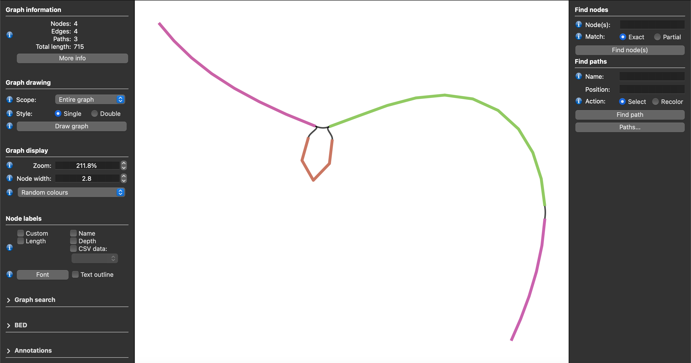

# Custom Visualization

For each window being processed, Lancet2 can optionally serialize two types of graphs that are generated during the variant calling process.
This can be enabled by passing a `.tar.gz` archive path to the `--out-graphs-tgz` flag — Lancet writes a single gzipped TAR bundle containing the per-window outputs:

1. the kmer-based colored de-bruijn overlap graph after the cleaning/pruning steps of the assembly
   process serialized as `DOT` formatted [graphviz](https://www.graphviz.org/) files. **One DOT file per
   connected component per window** — either `enumerated_walks` (when haplotype walks were
   successfully enumerated) or `fully_pruned` (when assembly stopped before walks could be enumerated).

2. the sequence graph generated from the multiple sequence alignment of all the assembled contigs
   from the de-bruijn graph assembly serialized as `GFA` formatted files.

```bash
Lancet2 pipeline --reference ref.fasta \
    --tumor tumor.bam --normal normal.bam \
    --region "chr22" --out-graphs-tgz output-graphs.tar.gz
```

## Why TAR.GZ instead of a directory tree

On shared filesystems (e.g. GPFS), per-file `mkdir` + `openat` operations serialize at the metadata server and add many minutes of unavoidable overhead at typical `--num-threads` settings when graph outputs are written as per-window files in a directory tree. Bundling all outputs into a single gzipped TAR archive cuts the metadata cost from ~hundreds-of-thousands of operations to two per worker (one open + one close), shifts the bottleneck from metadata-bound to sequential-write-bandwidth-bound, and as a side benefit gets a ~2-4× storage win from gzip compression of the text-heavy DOT/GFA/FASTA streams.

## Extracting the archive

Once Lancet2 finishes, extract the archive to recover the original per-window directory tree:

```bash
tar -xzf output-graphs.tar.gz -C extracted/
```

(Modern GNU `tar` auto-detects gzip via the `.gz` suffix, so `-xf` works in place of `-xzf` on most systems.)

The extracted tree has two top-level subdirectories:

- `dbg_graph/${CHROM}_${START}_${END}/` — `DOT` files for each component:
  `dbg__${CHROM}_${START}_${END}__${STAGE}__k${KMER_SIZE}__comp${COMP_ID}.dot`,
  where `${STAGE}` is `enumerated_walks` (walks enumerated successfully) or
  `fully_pruned` (graph pruned but no walks). Snapshots are written only for the
  k-attempt that succeeded — abandoned attempts (cycle / complexity retry) leave
  no artifacts in the archive.

- `poa_graph/${CHROM}_${START}_${END}/` — `GFA` files for each component:
  `msa__${CHROM}_${START}_${END}__c${COMP_ID}.gfa`. Each component subdirectory
  also contains a `FASTA` file with the raw multiple sequence alignment output.

For ad-hoc inspection of a single file without full extraction:

```bash
tar -xzOf output-graphs.tar.gz dbg_graph/chr22_X_Y/dbg__chr22_X_Y__enumerated_walks__k31__comp0.dot \
  | dot -Tpdf -o my_window.pdf
```

## DOT snapshot verbosity

The `--graph-snapshots` flag controls how much of the graph pruning pipeline gets
serialized. Two values are accepted:

- `final` (default) — emits exactly one DOT file per component per window:
  `enumerated_walks` or `fully_pruned`.
- `verbose` — additionally emits intermediate-stage snapshots after each post-
  compression pruning boundary (`compression1`, `low_cov_removal2`, `compression2`,
  `short_tip_removal`). Pre-compression stages are not snapshot — those graphs
  have tens of thousands of nodes per window and are unusable as rendered DOT.

```bash
# Default: one DOT per component per window
Lancet2 pipeline ... --out-graphs-tgz output-graphs.tar.gz

# Verbose: adds the four post-compression stages too
Lancet2 pipeline ... --out-graphs-tgz output-graphs.tar.gz --graph-snapshots verbose
```

This flag replaces the legacy `LANCET_DEVELOP_MODE` compile-time gate — verbose
snapshots are now an opt-in *runtime* feature, no rebuild required.

## Inspecting `DOT` formatted assembly graphs

The `DOT` files can be rendered in the pdf format using the dot utility available in
the [graphviz](https://www.graphviz.org/) visualization software package. The `DOT`
file can also be exported to various other [output formats](https://graphviz.org/docs/outputs/)
with the dot utility tool.

```bash
dot -Tpdf -o example_file.pdf example_file.dot
```

The above command will create a example_file.pdf file that shows the de-bruijn assembly graph.

### Visual encoding

Lancet2's DOT output uses **orthogonal styling axes** so multiple signals can stack
on a single node without losing information:

| Concern                     | Source                                | Visual encoding                             |
|:----------------------------|:--------------------------------------|:--------------------------------------------|
| Sample role                 | `Node::IsCaseOnly` / `IsCtrlOnly` / `IsShared` / `HasTag(REFERENCE)` | `fillcolor` (indianred / mediumseagreen / steelblue / lightblue) |
| Source/sink anchor          | `mSourceAndSinkIds`                   | heavy goldenrod border + double `peripheries` |
| Probe-marked k-mer (`--probe-variants`) | `ProbeTracker::GetHighlightNodeIds`   | `style="filled,striped"` with orchid stripe accent |
| Walk membership (per edge)  | enumerated haplotype walks            | graphviz native `colorList` (`color="#A:#B:#C"`) — parallel-color stripes |

A probe-marked anchor in a CASE-only k-mer renders all three signals simultaneously:
indianred fill + heavy goldenrod border + striped orchid accent. No signal is lost
to overlay precedence.

### Walk overlay (`enumerated_walks` files)

Each enumerated haplotype walk is colored with a **maximally-distinct** hex color
chosen from a 64-entry palette pre-computed via k-means clustering in CIE L\*a\*b\*
perceptual color space (see `scripts/gen_walk_palette.py`). The reference walk
(index 0) gets a fixed white accent (`#FFFFFF`) so it stands out as the backbone;
ALT walks consume the LAB palette starting at index 1.

When multiple walks share an edge, graphviz's native `colorList` renders the edge
as **parallel-color stripes** — the edge picks up all the walks that traverse it,
not just the dominant one. The bidirected mirror of every walked edge is colored
with the same style, so under the `neato` layout both anti-parallel splines carry
the walk's color.

### Verbose-mode intermediate stages

When `--graph-snapshots=verbose` is set, four additional DOT files per component
trace the graph through the pruning pipeline:

| Stage filename label         | Captured after                                  |
|:-----------------------------|:------------------------------------------------|
| `compression1`               | First unitig compression                        |
| `low_cov_removal2`           | Second pass low-coverage node removal           |
| `compression2`               | Second unitig compression                       |
| `short_tip_removal`          | Tip removal (recursive until stable)            |

Pre-compression stages (initial build, first low-coverage removal, anchor
discovery) are intentionally not snapshot — they have too many nodes to render
usefully. The first usable snapshot is `compression1`, after the graph collapses
into unitigs.

```bash
# Render every snapshot to PDF
for dot_file in output-graphs/dbg_graph/*/*.dot; do
    dot -Tpdf -o "${dot_file%.dot}.pdf" "${dot_file}"
done
```

## Inspecting `GFA` formatted sequence graphs

The generated [`GFA`](https://github.com/GFA-spec/GFA-spec) files can be visualized in
[Bandage](https://github.com/rrwick/Bandage) or [BandageNG](https://github.com/asl/BandageNG).

The GFA file generated by Lancet2 is chopped i.e the nodes are in their decomposed form. They
need to be unchopped using the [`vg toolkit`](https://github.com/vgteam/vg/releases), before
they can be visualized or used in other downstream processes. Below is a command to unchop
the Lancet2 GFA graph.

```bash
vg mod --unchop ${INPUT_GFA} > ${OUTPUT_GFA}
```

#### BandageNG
{ align=left, loading=lazy }

The image above shows a screenshot of an unchopped Lancet2 sequence graph in `GFA` format
visualized using the BandageNG toolkit.

#### Sequence Tube Map
Lancet2 addresses the longstanding challenge of visualizing variants along with supporting reads from multiple samples in graph space.
Users can easily load the unchopped `GFA` formatted graphs into the Sequence Tube Map environment allowing somatic variants' visualization
along with their supporting read alignments from multiple samples.

The following steps describe the workflow to visualize Lancet2 variants of interest in graph space using the Sequence Tube Map framework.

1. Install prerequisite tools – Lancet2 (https://github.com/nygenome/Lancet2), samtools, bcftools, vg version 1.59.0,
and jq, and ensure that they are available as commands that can be executed in the environment PATH.

2. Install Sequence Tube Map (https://github.com/vgteam/sequenceTubeMap) version [0452ecb82d057372e359a9b456d789336e5ab8a1](https://github.com/vgteam/sequenceTubeMap/tree/0452ecb82d057372e359a9b456d789336e5ab8a1).

3. Use the Lancet2's [`prep_stm_viz.sh`](https://github.com/nygenome/Lancet2/blob/main/scripts/prep_stm_viz.sh) script to run Lancet2 on a small set of variants of interest that need to be
   visualized in Sequence Tube Map. The script will run Lancet2 using the `--out-graphs-tgz` flag, then `tar -xzf` the resulting
   archive to recover the GFA-formatted sequence graphs for each variant of interest. Local VG graphs and indices required to load the sample reads along
   with the Lancet2 graph are then constructed enabling simplified use with "custom" data option in Sequence Tube Map interface.

4. After running the Sequence Tube Map Server as detailed in the Tube Map Readme, set “Data” to “custom” and “BED file”
   to “index.bed”. Pick a “Region”(or variant) of interest and hit “Go” to visualize.

##### Demo Sequence Tube Map server
Sequence Tube Map demo server containing somatic variants from COLO829 tumor/normal pair
sample can be found at this link – https://shorturl.at/JQZsy
